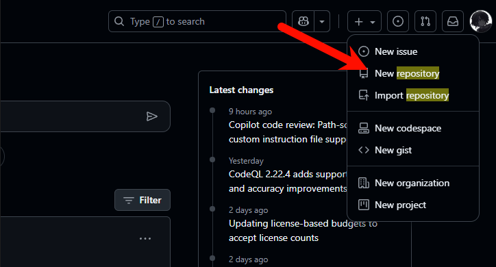

# GitHub 新手入门指南

[GitHub 官网](https://github.com)

---

## 一、什么是 GitHub

### 🛠 核心概念
- **代码托管平台**：基于 Git 版本控制系统，帮助开发者存储、管理和追踪代码历史版本。
- 协作开发：支持多人同时参与同一项目，方便团队分工、合并代码和解决冲突。
- **开源与私有仓库**：既可公开分享代码（开源），也可建立私有仓库保护项目隐私。

### 📦 主要功能
- **版本控制**：记录每一次代码修改，可随时回溯历史版本。
- **Pull Request（PR）**：提交代码修改建议，方便团队审查和讨论。
- **Issues**：跟踪 bug、功能需求或任务。
- **GitHub Pages**：直接用仓库托管静态网站或博客。
- **Gist**：分享代码片段或文档的小工具。
- **社交功能**：关注（Follow）、收藏（Star）、派生（Fork）项目，形成开发者社区。

### 🌍 发展与现状
- **成立时间**：2008 年，由 Tom Preston-Werner、Chris Wanstrath 等人创立。
- **收购**：2018 年被微软以 75 亿美元收购。
- **用户规模**：截至 2023 年，已有超过 1 亿开发者和数亿个代码仓库。
- **影响力**：全球最大的开源社区和代码托管平台之一。

---

## 二、注册账户
1. 访问 [GitHub 官网](https://github.com) 注册账号。
2. 完成基础设置，即可开始创建属于自己的仓库（Repository）。

---

## 三、创建仓库

> **注意**：免费用户只能创建公共仓库（Public）。

1. 点击右上角头像旁的 **"+"** → **New repository**  
   ](https://raw.githubusercontent.com/moiunaochen/github-beginners-tutorial/refs/heads/main/assets/1.png)

   

2. 填写信息：
   - **Repository name**：仓库名称
   - **Description**：仓库描述（可选）
   - **Public**：选择公共仓库
   - **Initialize this repository with a README**（可选）
3. 点击 **Create repository** 创建仓库。

> 额外选项：
> - **.gitignore**：忽略不需要版本管理的文件
> - **License**：选择开源许可证


---

## 四、什么是 Git

Git 是一种 **分布式版本控制系统**，由 **Linus Torvalds** 于 2005 年创建，用于高效管理 Linux 内核开发。  
它是 GitHub、GitLab 等平台的底层核心。

### 🛠 核心作用
- **版本控制**：记录文件修改历史，可回溯到任意版本。
- **多人协作**：支持多人同时开发并合并修改。
- **分支管理**：不同功能的开发互不干扰。
- **离线工作**：每台电脑都有完整版本库，即使离线也可提交。

💡 **类比**：就像游戏存档，可以随时回到之前的状态。

---

## 五、安装 Git

1. 进入 [Git 下载页面](https://git-scm.com/downloads)（以 Windows 为例）  
   

2. 下载并双击运行，安装时保持默认选项即可。

3. 检查是否安装成功：
   ```bash
   git --version
   ```
   

## 六、配置 Git（以 VS Code 为例）

1. 下载并安装 [VS Code](https://code.visualstudio.com/)  

2. 在 VS Code 中创建项目文件夹，并添加一个示例文件。  
   

3. 初始化仓库 → 提交存档 → 选择 **Always**。  
     
     
   

4. 提示设置 用户名 和 邮箱(在终端执行2条命令)：  
     
   

   （一般不用看）[Git名称邮箱详细配置教程](https://git-scm.com/book/zh/v2/%e8%b5%b7%e6%ad%a5-%e5%88%9d%e6%ac%a1%e8%bf%90%e8%a1%8c-Git-%e5%89%8d%e7%9a%84%e9%85%8d%e7%bd%ae)    
   ```bash
   git config --global user.name "你的GitHub用户名"
   git config --global user.email "你的GitHub邮箱"
   ```

## 七、将项目发布到 GitHub

1. 查看历史记录： 
   

2. 在 VS Code 中选择 发布到 GitHub → 浏览器授权 → 同意。 
     
     

3. 然后会出现两个选项，公开和私有，选择公开  
         

4. 一般情况这里会上传失败，因为没有设置 代理  
     
       

5. 打开终端，将下面的信息改成自己的，然后执行  
   [详细代理教程](https://stackoverflow.com/questions/783811/getting-git-to-work-with-a-proxy-server-fails-with-request-timed-out)
 ```bash
   git config --global http.proxy http://127.0.0.1:7897`    
   git config --global https.proxy https://127.0.0.1:7897`      
 ```

6. 提交成功后即可在 GitHub 查看项目。 
   

## 八、总结

- GitHub 是全球最大的开源代码托管平台。

- Git 是它的核心技术，负责版本控制与协作。

- 熟悉 Git + VS Code，可以高效管理和发布项目。

- 如果需要国内访问更快，可以同步到 Gitee。

## 九、Git 常用命令速查表

| 命令 | 作用 |
|------|------|
| `git init` | 初始化本地仓库 |
| `git clone <url>` | 克隆远程仓库到本地 |
| `git status` | 查看状态 |
| `git add <file>` | 将文件添加到暂存区 |
| `git add .` | 添加所有修改到暂存区 |
| `git commit -m "说明"` | 提交暂存区到本地仓库 |
| `git log` | 查看提交记录 |
| `git diff` | 查看文件的变化 |
| `git branch` | 查看分支 |
| `git branch <name>` | 创建新分支 |
| `git checkout <branch>` | 切换分支 |
| `git merge <branch>` | 合并指定分支到当前分支 |
| `git pull` | 拉取远程仓库代码并合并 |
| `git push` | 推送代码到远程仓库 |
| `git remote -v` | 查看远程仓库 |
